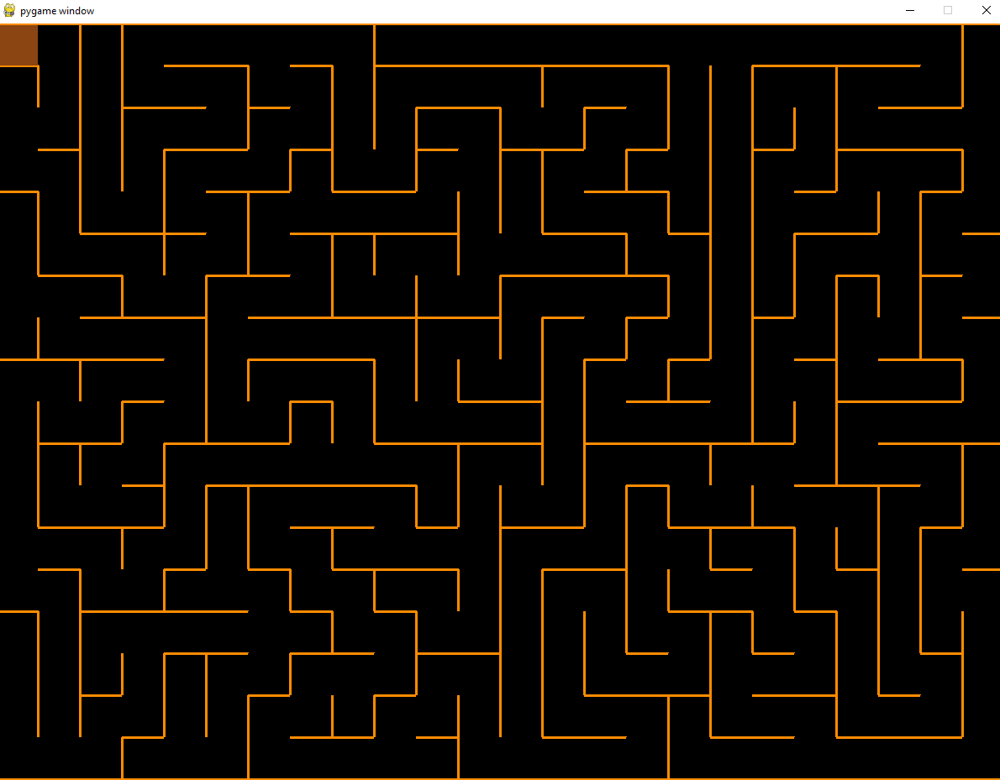
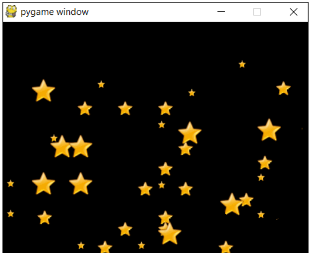

# **Лабиринт на PyGame**
___

###_Основные цели игры:_
- Развивать мышление и внимательность 
- Дать расслабиться человеку после очередного трудного дня
### _Основной функционал:_
+ **Первым делом, вас приветствует регистрация**
+ **Меню игры**:
    * вы можете загрузить прошлый сеанс игры
    * вы можете начать заново играть в эту прекрасную игру задав уровень сложности, то есть размер лабиринт и количество врагов
    * вы можете покинуть игру(
+ **Далее идет КРАСИВАЯ загрузка лабиринта**
  
  * Вы спавнитесь в верхнем левом углу карты. 
  * Вам требуется добраться до выхода - двери. 
  * Если дойдете, то вы выиграли и выскачут звездочки.
  
    
