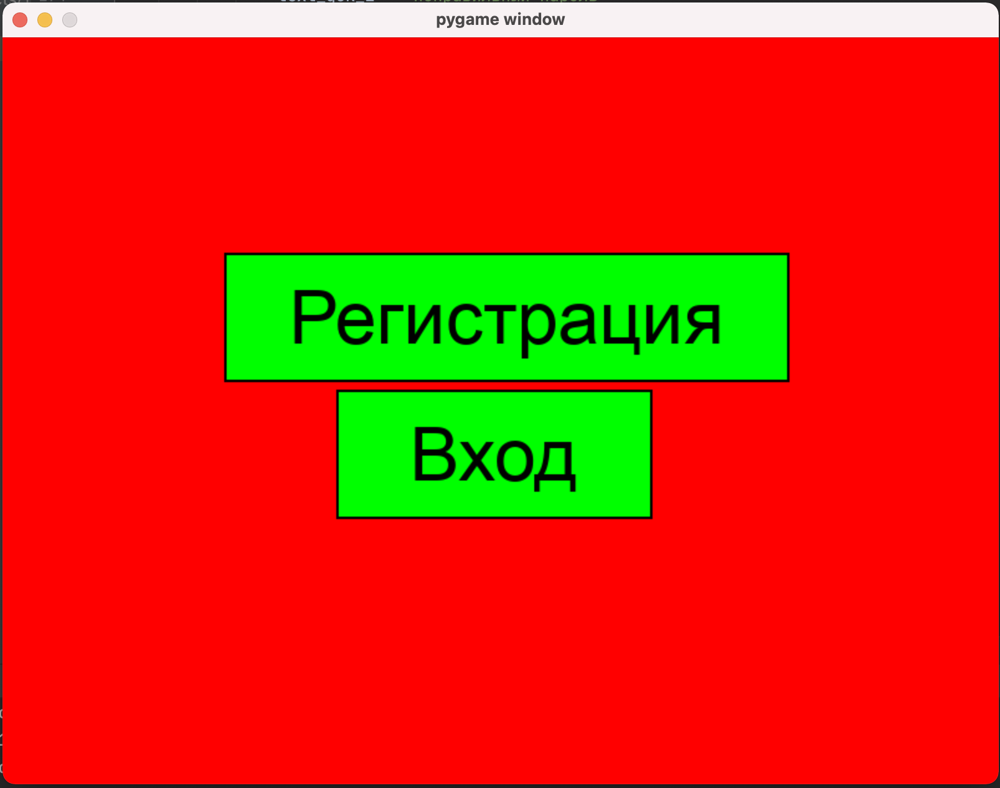
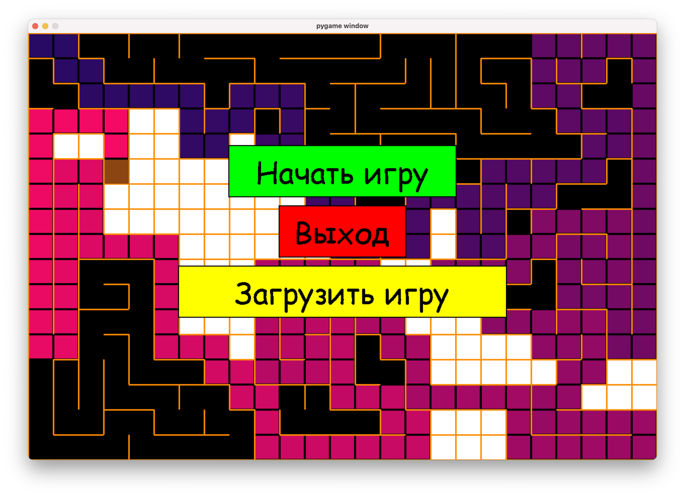
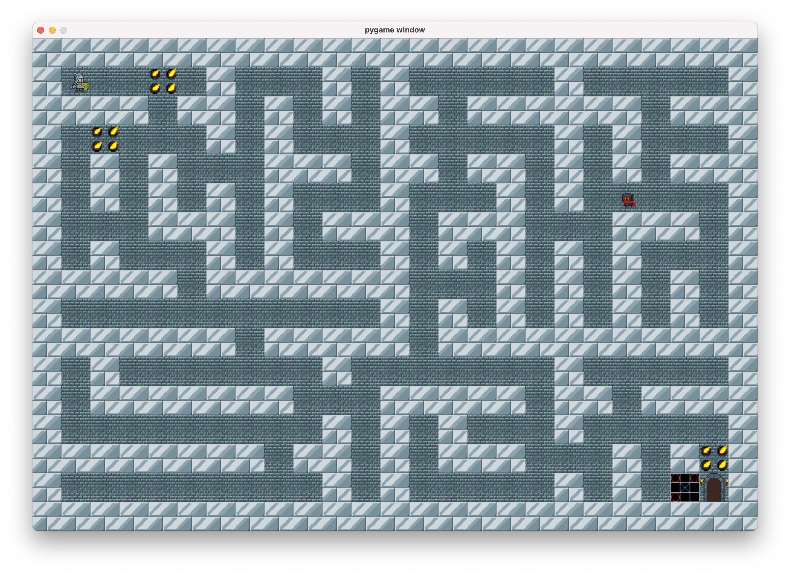
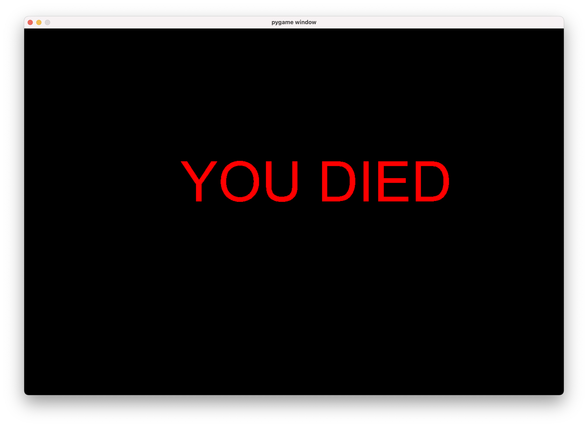
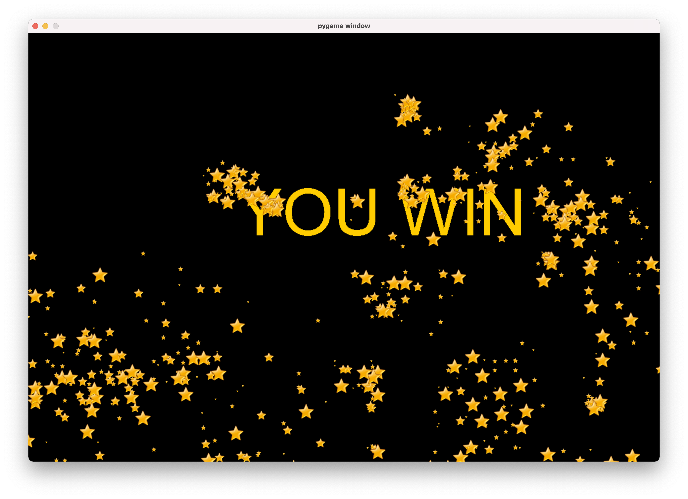

# Техническое задание
## Цель:
Разработать аналог лабиринта с помощью библиотеки PyGame
## Задачи:
1. Проанализировать существующую игру Лабиринт
2. Добавить много нового в эту игру
## Участники и их обязанности:
1. Мухаметзянов Дамир(Teamlead)
- Руководство командов и распределение обязанностей
- Исправление ошибок и коррекция програмного кода
- реализация движка игры
- создание логики
2. Фазульзянов Амир
- все сохранения
- работа с БД
- добавление фишек
- Пояснительная записка
3. Тухбатуллин Амир
- Создание начального экрана
- Создание регистрации на библиотеке PyGame
- ТЗ, презентация
## Техническая часть
### Регистрация

### Стартовое окно
Меню регистрации. На фоне идет красивая генерация карты

### Запуск игры
Прохождение лабиринта с различными препятствиями и мини-играми

### Посдсчет результатов после прохождения уровня
Итоги(количество секунд) прохождения выводятся в консоль
### Финальное окно
Есть два варианта финального окна: или вы выиграли, или вы проиграли

### Смысл игры:
Наша игра является аналогом обычной игры Лабиринт с добавлением различных фич. Игроку нужно пройти лабиринт(карта генерируется всегда по-новому), победить всех противников! 
